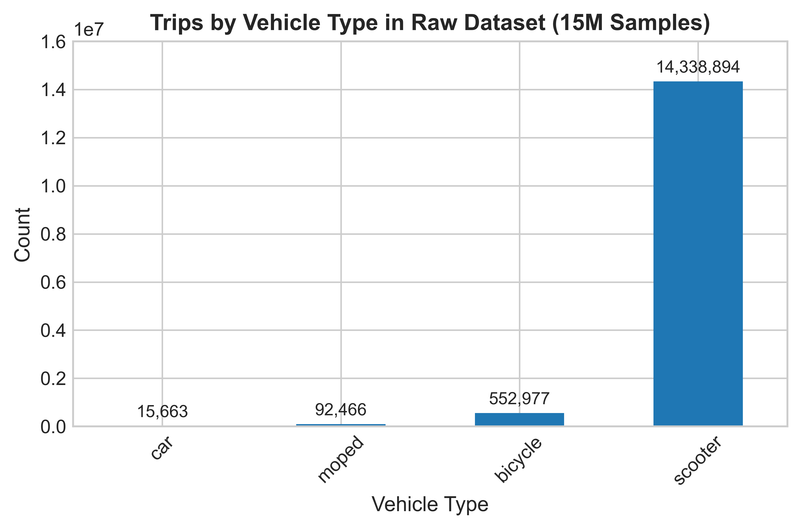
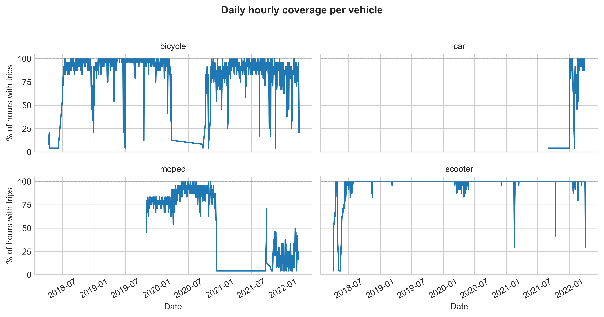
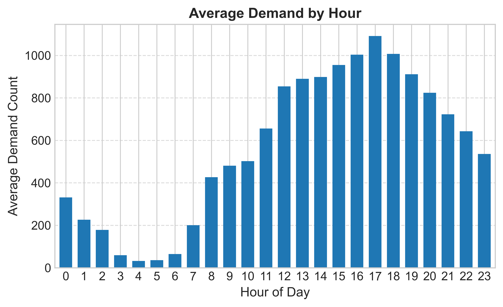
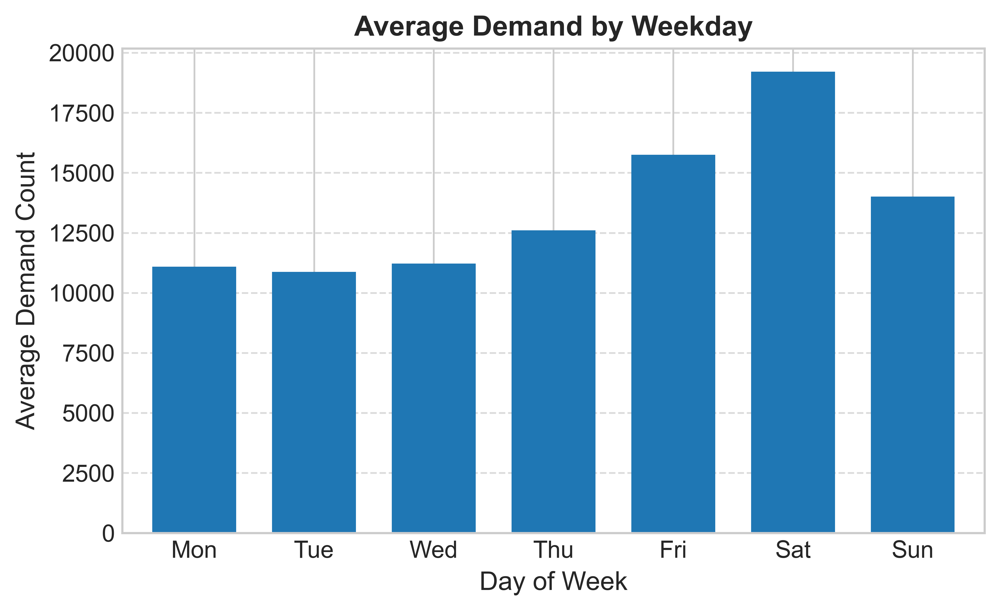
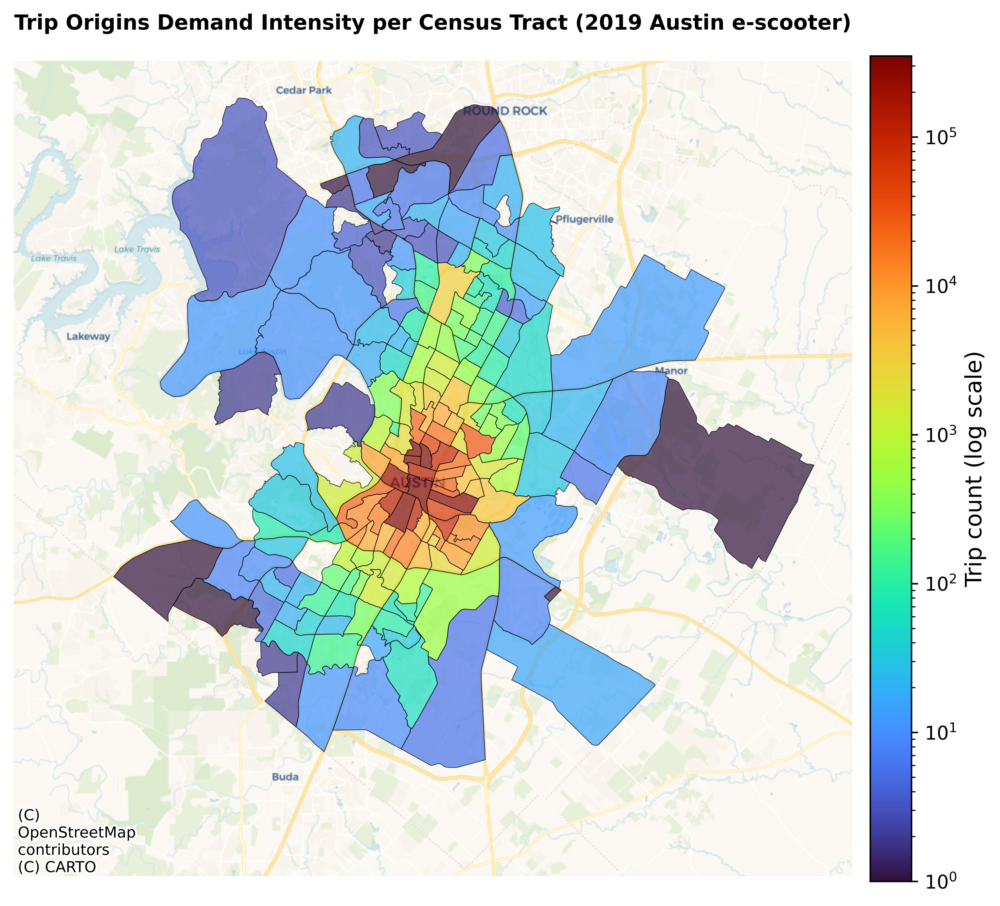
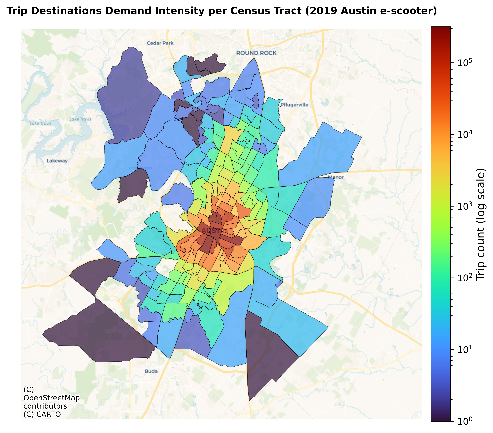
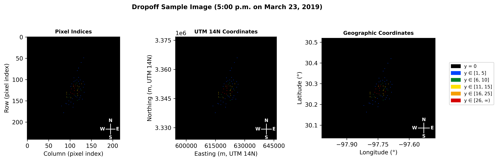
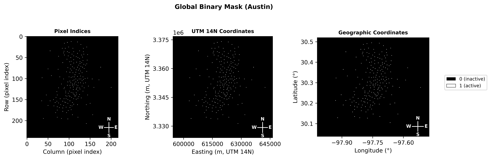

# Austin, TX Micromobility Dataset Pipeline

This repository contains a clean, reproducible data-processing pipeline for the Austin, TX micromobility study used in the journal paper titled as:

"A Grid-Based Framework for E-Scooter Demand Representation and Temporal Input Design for Deep Learning: Evidence from Austin, Texas"

The pipeline is limited to:
- Raw trip record acquisition.
- Census tract centroid mapping.
- Cleaned 2019 e-scooter dataset generation.
- Hourly pickup/dropoff demand image generation.
- Global binary activity mask generation.

It does **not** include lag analysis, ranking, model training, or statistical tests.

## Relation to the Paper

This code operationalizes the dataset-preparation workflow used before model development:
1. Ingest raw Austin trip records.
2. Map trip start/end Census tract IDs to spatial coordinates.
3. Produce a cleaned 2019 e-scooter trip table.
4. Generate hourly grid-based pickup/dropoff demand images.
5. Generate the global binary activity mask.

## Figures (From the Paper)

The following figures are included to help users quickly understand the data context and the final images produced by this pipeline.

### Raw Dataset Composition and Temporal Behavior


Figure: Vehicle type distribution in the Austin micromobility raw records.


Figure: Temporal coverage diagnostic of the raw dataset.

### Processed Dataset Temporal Patterns (E-scooter 2019)


Figure: Average hourly demand profile.


Figure: Average demand by day-of-week.

### Spatial Grid Visulaization over Austin, TX


Figure: Spatial grid formation over Census Tracts.

### Processed Dataset Spatial Demand Distribution (E-scooter 2019)


Figure: Demand Intensity of e-scooter trip origins (pickup).


Figure: Demand Intensity of e-scooter trip destinations (dropoff).

### Samples of the Generated Grid-based Hourly Demand Images (E-scooter 2019)


Figure: Example pickup demand representation in pixel, projected, and geographic coordinates.


Figure: Example dropoff demand representation in pixel, projected, and geographic coordinates.

### Global Binary Activity Mask (E-scooter 2019)


Figure: Final global binary activity mask shown in pixel, projected, and geographic coordinates.

## Pipeline Stages

### Stage 1: Download Raw Trips + Tract Centroid Mapping
- Downloads Austin trip records from Socrata dataset `7d8e-dm7r`.
- Default limit is `15000000` (same as original workflow).
- Attaches `startx/starty/endx/endy` by matching tract IDs to centroids from:
  - `data/reference/Austin_205_tracts_from_TIGER.csv`

Output:
- `data/interim/stage1_austin_trip_records_with_tract_centroids.csv`

### Stage 2: Standardize Core Trip Table
- Converts timestamps to US/Central local time.
- Builds `start_date`, `start_hour`, `start_day_of_week`.
- Converts:
  - `trip_duration` seconds -> `trip_duration_min`
  - `trip_distance` meters -> `trip_length_km`
- Keeps the core columns used downstream.

Output:
- `data/processed/stage2_austin_trips_standardized.csv`

### Stage 3: Build Final 2019 E-Scooter Dataset
- Filters to scooter trips.
- Filters to calendar year 2019 (local start date).
- Applies quality rules:
  - `trip_duration_min` in `[1, 120]`
  - `trip_length_km` in `[0.1, 35]`
  - `avg_speed_kmh` in `[2, 26]`
- Drops rows with missing required fields.
- Keeps rows whose start and end tracts are in the 205-tract reference (Within Austin, TX city limits).

Output:
- `data/final/final_austin_escooter_2019_dataset.csv`

### Stage 4: Generate Hourly Demand Images
- Projects lon/lat to UTM 14N (`EPSG:32614`).
- Builds raster grid from Austin city boundary:
  - `data/reference/BOUNDARIES_jurisdictions_20250809.geojson`
- Uses fixed cell size:
  - `240m x 220m`
- Generates full 2019 hourly image sets:
  - pickup: `pickup_{index:04}_{YYYY-MM-DD}_{hour}.png`
  - dropoff: `dropoff_{index:04}_{YYYY-MM-DD}_{hour}.png`

Output folders:
- `data/outputs/pickup_scooter_Austin_2019/`
- `data/outputs/dropoff_scooter_Austin_2019/`

The PNG filename format is intentionally kept identical to the original workflow.

### Stage 5: Generate Global Binary Activity Mask
- Uses the final Stage 3 dataset (already filtered to Austin city trips).
- Projects lon/lat to UTM 14N (`EPSG:32614`).
- Uses the same city-derived raster grid definition as Stage 4:
  - city boundary: `data/reference/BOUNDARIES_jurisdictions_20250809.geojson`
  - cell size: `240m x 220m`
- Marks a grid cell as active (`1`) if at least one pickup or dropoff falls in that cell.
- Saves a 16-bit binary PNG with values `0` or `1`.

Output:
- `data/outputs/global_mask_austin/Global_Mask_Austin_2019.png`

## Repository Structure

```text
austin_tx_dataset_pipeline/
|-- config/
|   `-- pipeline_config.example.yaml
|-- docs/
|   `-- figures/
|       |-- vehicle_type_counts.png
|       |-- avg_demand_by_hour.png
|       |-- avg_demand_by_dow.png
|       |-- daily_hourly_coverage_facets.png
|       |-- trip_origins_density_map.png
|       |-- trip_destinations_density_map.png
|       |-- global_mask_triptych.png
|       |-- pickup_balanced_all_bins_triptych.png
|       `-- dropoff_balanced_all_bins_triptych.png
|-- data/
|   |-- reference/
|   |   |-- Austin_205_tracts_from_TIGER.csv
|   |   `-- BOUNDARIES_jurisdictions_20250809.geojson
|   |-- raw/
|   |-- interim/
|   |-- processed/
|   |-- final/
|   `-- outputs/
|-- scripts/
|   |-- stage1_download_and_match_tract_centroids.py
|   |-- stage2_build_processed_trip_table.py
|   |-- stage3_build_final_2019_escooter_dataset.py
|   |-- stage4_generate_hourly_demand_images.py
|   |-- stage5_generate_global_binary_mask.py
|   |-- build_austin_205_tract_reference_from_tiger.py
|   `-- run_full_pipeline.py
|-- src/
|   `-- austin_tx_pipeline/
|       |-- config.py
|       |-- logging_utils.py
|       |-- stage1_download_and_match.py
|       |-- stage2_standardize_table.py
|       |-- stage3_build_final_dataset.py
|       |-- stage4_generate_demand_images.py
|       |-- stage5_generate_global_mask.py
|       `-- tract_reference.py
|-- .gitignore
|-- LICENSE
|-- requirements.txt
`-- README.md
```

## Installation

1. Create and activate a Python environment (Python 3.9+ recommended).
2. Install dependencies:

```bash
pip install -r requirements.txt
```

## Run Instructions

Run from repository root (`austin_tx_dataset_pipeline`).

### Stage-by-stage

```bash
python scripts/stage1_download_and_match_tract_centroids.py
python scripts/stage2_build_processed_trip_table.py
python scripts/stage3_build_final_2019_escooter_dataset.py
python scripts/stage4_generate_hourly_demand_images.py
python scripts/stage5_generate_global_binary_mask.py
```

### End-to-end (YAML config)

```bash
python scripts/run_full_pipeline.py --config config/pipeline_config.example.yaml
```

## Optional Utility: Regenerate Austin_205_tracts_from_TIGER.csv

Normal pipeline execution uses the committed tract reference file directly.

Use this script only for revalidation:

```bash
python scripts/build_austin_205_tract_reference_from_tiger.py \
  --trips-csv data/final/final_austin_escooter_2019_dataset.csv \
  --city-boundary-geojson data/reference/BOUNDARIES_jurisdictions_20250809.geojson \
  --tiger-zip path/to/tl_2010_48_tract10.zip \
  --output-csv data/reference/Austin_205_tracts_from_TIGER.csv
```

## Configuration Notes

- Stage 1 uses `limit=15000000` by default.
- For quick tests, reduce `limit` in CLI or config.
- If you have a Socrata app token, set `SOCRATA_APP_TOKEN` or pass `--app-token`.

## Required Inputs

- Online Austin Socrata dataset (`7d8e-dm7r`) for raw trip records.
- Committed local reference files:
  - `data/reference/Austin_205_tracts_from_TIGER.csv`
  - `data/reference/BOUNDARIES_jurisdictions_20250809.geojson`

## Reference Data Sources (Files Already Included)

Both geospatial reference files already exist in this repository under `data/reference/`.

Official source links used for provenance:
- Austin jurisdictions boundary (`BOUNDARIES_jurisdictions`):
  - https://data.austintexas.gov/City-Government/BOUNDARIES_jurisdictions/vnwj-xmz9/about_data
- U.S. Census TIGER 2010 Census Tracts portal:
  - https://www.census.gov/cgi-bin/geo/shapefiles/index.php?year=2010&layergroup=Census+Tracts
  - Texas file used: `tl_2010_48_tract10.zip`

## Outputs Summary

- Stage 1: Raw table with mapped tract centroids.
- Stage 2: Standardized compact trip table.
- Stage 3: Final cleaned 2019 e-scooter dataset.
- Stage 4: Hourly pickup/dropoff image tensors (PNG files).
- Stage 5: Global binary activity mask (`Global_Mask_Austin_2019.png`).

## Reproducibility Notes

- Stage outputs depend on the downloaded Socrata snapshot at execution time.
- City boundary and tract reference are versioned in `data/reference/`.
- Image naming format is fixed and reproducible.

## Geospatial Dependencies and Assumptions

- Input coordinates are lon/lat (`EPSG:4326`).
- Raster generation uses UTM Zone 14N (`EPSG:32614`).
- Grid extent is derived from Austin city boundary geometry.
- Tract membership uses 6-digit tract code matching (`TRACTCE10`) from trip GEOIDs.

## Runtime and Storage Considerations

- Stage 1 and Stage 2 are large-scale I/O operations for 15M records.
- Ensure sufficient disk space for intermediate CSV files and PNG outputs.
- Stage 4 writes `365 x 24 = 8760` images per channel (pickup + dropoff).
- Stage 5 writes one additional binary PNG mask on the same grid.

## Citation

If you use this pipeline, cite:
- Our paper: [1] M. Sahnoon, M. G. Demissie, and R. Souza, "A grid-based framework for e-scooter demand representation and temporal input design for deep learning: Evidence from Austin, Texas," 2026. [Online]. Available: https://arxiv.org/abs/2603.13609
- Austin Open Data source for trip records [2] and jurisdiction boundary source [3]:

  [2] City of Austin Open Data Portal, “Shared Micromobility Vehicle Trips (2018-2022).” Accessed: XXX. XX, XXXX. [Online]. Available: https://data.austintexas.gov/Transportation-and-Mobility/Shared-Micromobility-Vehicle-Trips-2018-2022-/7d8e-dm7r


  [3] City of Austin Open Data Portal, “BOUNDARIES_jurisdictions.” Accessed: XXX. XX, XXXX. [Online]. Available: https://data.austintexas.gov/City-Government/BOUNDARIES_jurisdictions/vnwj-xmz9/about_data
  
  
- U.S. Census TIGER/Line tract source used for tract reference preparation: 

  [4] US Census Bureau, “2010 TIGER/Line Shapefiles: Census Tracts.” Accessed: XXX. XX, XXXX. [Online]. Available: https://www.census.gov/cgi-bin/geo/shapefiles/index.php?year=2010&layergroup=Census+Tracts

## Limitations / Disclaimer

- This repository is for research reproducibility.
- Data source schemas can evolve over time.
- Results can vary if upstream raw records change after publication date.
